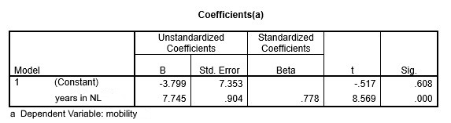

```{r, echo = FALSE, results = "hide"}
include_supplement("uu-Equation-801-nl-tabel.jpg", recursive = TRUE)
```

```{r, echo = FALSE, results = "hide"}
include_supplement("uu-Equation-801-nl-tabel2.jpg", recursive = TRUE)
```


Question
========
  
The output below shows the results of Van den Berg's research. 


Later, a third variable was included in the analysis namely number of years living in the Netherlands. The researcher thus aims to predict the social mobility of native women based on the number of years living in the Netherlands. 




Set up the regression equation: 
Answerlist
----------
* Yp = -3,799 + 7,745 - number of years in the Netherlands
* Yp = 7,745 + .778- number of years in the Netherlands
* Yp = -3.799 + .778 - social mobility
* Yp = 7,745 + -3,799 - social mobility

Solution
========

Meta-information
================
exname: uu-Equation-801-en
extype: schoice
exsolution: 1000
exsection: Inferential Statistics/Regression/Equation
exextra[Type]: Interpretating output
exextra[Program]: SPSS
exextra[Language]: English
exextra[Level]: Statistical Literacy
