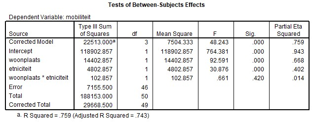
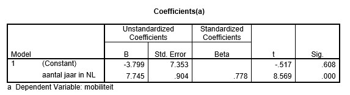

```{r, echo = FALSE, results = "hide"}
include_supplement("uu-Equation-801-nl-tabel.jpg", recursive = TRUE)
```

```{r, echo = FALSE, results = "hide"}
include_supplement("uu-Equation-801-nl-tabel2.jpg", recursive = TRUE)
```


Question
========
  
In onderstaande output is af te lezen wat de resultaten zijn van het onderzoek van Van den Berg. 



Later is er een derde variabele opgenomen in de analyse namelijk aantal jaren woonachtig in Nederland. De onderzoeker wil daarmee de sociale mobiliteit van autochtone vrouwen voorspellen aan de hand van het aantal jaren dat ze in Nederland wonen. 




Stel de regressievergelijking op: 
  
Answerlist
----------
* Yp = -3.799 + 7.745 · aantal jaren in Nederland
* Yp = 7.745 + .778· aantal jaren in Nederland
* Yp = -3.799 + .778 · sociale mobiliteit
* Yp = 7.745 + -3.799 · sociale mobiliteit


Solution
========
  


Meta-information
================
exname: uu-Equation-801-nl.Rmd
extype: schoice
exsolution: 1000
exsection: Inferential Statistics/Regression/Equation
exextra[ID]: 9c5ef
exextra[Type]: Interpretating output
exextra[Program]: SPSS
exextra[Language]: Dutch
exextra[Level]: Statistical Literacy
