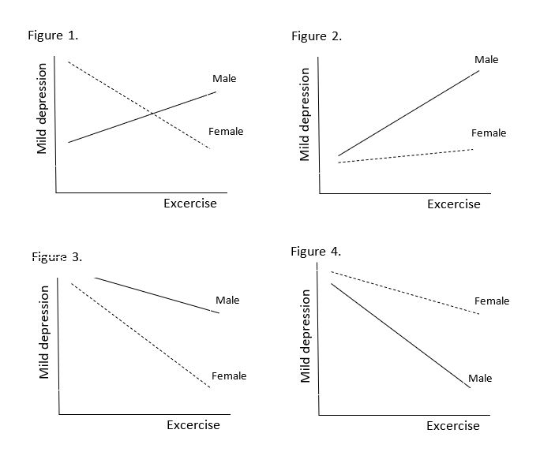

```{r, echo = FALSE, results = "hide"}
include_supplement("uu-Equation-803-en-tabel.JPG", recursive = TRUE)
```


Question
========
  
The following regression equation is given to predict mild depression:

y =a+b_1 (Exercise)+b_2 (Gender)+b_3 (Gender*Exercise), 

where the variable Gender is coded as Male = 0 and Female = 1. Which of the following figures matches the following statements: b_1<0, b_2>0, and b_3>0?



  
Answerlist
----------
* Figure 1
* Figure 2
* Figure 3
* Figure 4

Solution
========
  

Answerlist
----------
* This answer is incorrect.
* This answer is incorrect.
* This answer is incorrect.
* This answer is correct.

Meta-information
================
exname: uu-Equation-803-en.Rmd
extype: schoice
exsolution: 0001
exsection: Inferential Statistics/Regression/Equation
exextra[Type]: Interpretating graph
exextra[Program]: SPSS
exextra[Language]: English
exextra[Level]: Statistical Literacy