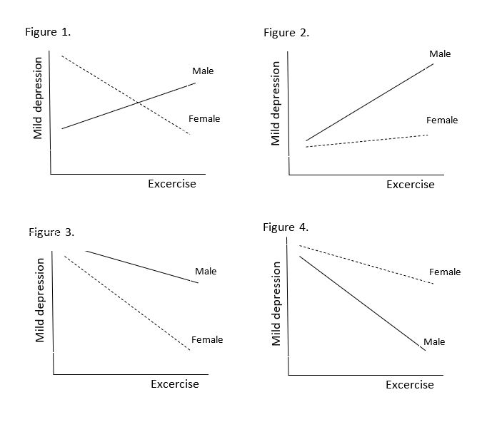

```{r, echo = FALSE, results = "hide"}
include_supplement("uu-Equation-803-en-tabel.JPG", recursive = TRUE)
```


Question
========
  
De volgende regressievergelijking wordt gegeven om milde depressie te voorspellen:

y =a+b_1 (Bewegen)+b_2 (Geslacht)+b_3 (Geslacht*Bewegen),

waarbij de variabele Geslacht is gecodeerd als Man = 0 en Vrouw = 1. Welke van de volgende cijfers komt overeen met de volgende Stellingen: b_1<0, b_2>0, en b_3>0?



  
Answerlist
----------
* Figuur 1
* Figuur 2
* Figuur 3
* Figuur 4

Solution
========
  

Answerlist
----------
* Dit antwoord is onjuist.
* Dit antwoord is onjuist.
* Dit antwoord is onjuist.
* Dit antwoord is juist.

Meta-information
================
exname: uu-Equation-803-nl
extype: schoice
exsolution: 0001
exsection: Inferential Statistics/Regression/Equation
exextra[ID]: 5e661
exextra[Type]: Interpretating graph
exextra[Program]: SPSS
exextra[Language]: Dutch
exextra[Level]: Statistical Literacy