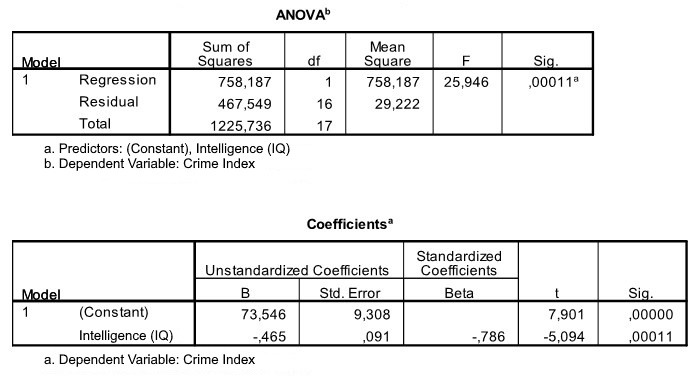

```{r, echo = FALSE, results = "hide"}
include_supplement("uu-Equation-806-nl-tabel.jpg", recursive = TRUE)
```

Question
========
  
A psychologist attached to a prison is interested in the relationship between crime and intelligence. A crime index (between 0 and 50) is formulated that takes into account the severity and frequency of crimes committed. Intelligence is measured with a standardized IQ test. Eighteen convicted juveniles participate in this study. SPSS was used to describe the relationship between the two variables. Part of the SPSS output is shown below.


  
Answerlist
----------
* Ŷ (intelligence) = 73.546 - 0.465 x Crime
* Ŷ (crime) = 73.546 - 0.465 x Intelligence
* Ŷ (crime) = 73.546 + 9.308 x Intelligence
* Ŷ (intelligence) = -0.786 x Crime


Solution
========

Meta-information
================
exname: uu-Equation-806-en
extype: schoice
exsolution: 0100
exsection: Inferential Statistics/Regression/Equation
exextra[ID]: e84e9
exextra[Type]: Interpretating output
exextra[Program]: SPSS
exextra[Language]: English
exextra[Level]: Statistical Literacy
