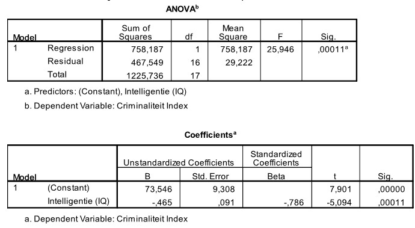

```{r, echo = FALSE, results = "hide"}
include_supplement("uu-Equation-806-nl-tabel.jpg", recursive = TRUE)
```


Question
========
  
Een psycholoog verbonden aan een gevangenis is geïnteresseerd in de relatie tussen criminaliteit en intelligentie. Een criminaliteitsindex (tussen 0 en 50) wordt geformuleerd die rekening houdt met de zwaarte en de frequentie van de gepleegde misdrijven. Intelligentie wordt gemeten met een gestandaardiseerde IQ test. Achttien veroordeelde jongeren doen mee met dit onderzoek. SPSS is gebruikt om de relatie tussen de twee variabelen te beschrijven. Deel van de SPSS output is hieronder te zien.


  
Answerlist
----------
* ŷ (intelligentie) = 73.546 − 0.465 x Criminaliteit
* ŷ (criminaliteit) = 73.546 − 0.465 x Intelligentie  
* ŷ (criminaliteit) = 73.546 + 9.308 x Intelligentie
* ŷ (intelligentie) = −0.786 x Criminaliteit


Solution
========
  


Meta-information
================
exname: uu-Equation-806-nl.Rmd
extype: schoice
exsolution: 0100
exsection: Inferential Statistics/Regression/Equation
exextra[ID]: 92167
exextra[Type]: Interpretating output
exextra[Program]: SPSS
exextra[Language]: Dutch
exextra[Level]: Statistical Literacy
