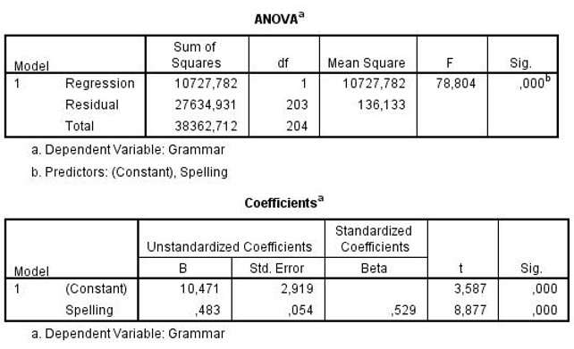

```{r, echo = FALSE, results = "hide"}
include_supplement("uu-Equation-807-nl-tabel.jpg", recursive = TRUE)
```

Question
========
  
A survey of British elementary school collects data on a variety of variables related to children's intelligence and achievement (such as reading, spelling, general knowledge). The analysis below looks at whether, for children in grade 7, grammar (grammar) scores can be predicted using spelling scores. 



Niels scores 45 points for spelling. What is his predicted value on grammar? 
Answerlist
----------
* 21.74
* 32.21
* 34.28
* 82.70


Solution
========
  
Ŷ=10.471+0.483x x=45 Ŷ=10.471+0.483×45=10.471+21.735=32.206

1) Constant (10.471) not included in the calculation. 3) Beta (0.529) used instead of B. 4) Entered X (= 45) in place of Y.

Meta-information
================
exname: uu-Equation-807-en
extype: schoice
exsolution: 0100
exsection: Inferential Statistics/Regression/Equation
exextra[Type]: Interpretating output
exextra[Program]: SPSS
exextra[Language]: English
exextra[Level]: Statistical Literacy
