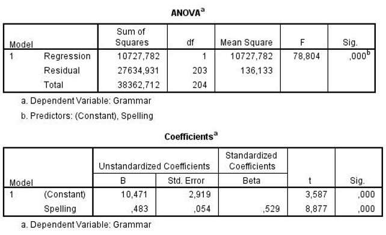

```{r, echo = FALSE, results = "hide"}
include_supplement("uu-Equation-807-nl-tabel.jpg", recursive = TRUE)
```


Question
========
  
Bij een onderzoek onder Britse basisscholen wordt er data verzameld over allerlei variabelen die te maken hebben met de intelligentie en prestatie van de kinderen (zoals lezen, spelling, algemene kennis). In onderstaande analyse wordt gekeken of voor kinderen in groep 7 de score op grammar (grammatica) voorspeld kan worden met behulp van de scores op spelling. 



Niels scoort 45 punten voor spelling. Wat is zijn voorspelde waarde op grammatica?
  
Answerlist
----------
* 21.74
* 32.21 
* 34.28
* 82.70


Solution
========
  
Ŷ=10.471+0.483x 
x=45 
Ŷ=10.471+0.483×45=10.471+21.735=32.206 

1) Constante (10.471) niet meegenomen in de berekening.
3) Beta (0.529) gebruikt in plaats van B.
4) X (= 45) ingevuld op de plek van Y.


Answerlist
----------


Meta-information
================
exname: uu-Equation-807-nl.Rmd
extype: schoice
exsolution: 0100
exsection: Inferential Statistics/Regression/Equation
exextra[Type]: Interpretating output
exextra[Program]: SPSS
exextra[Language]: Dutch
exextra[Level]: Statistical Literacy
