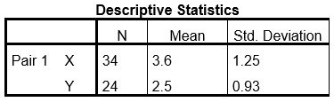

```{r, echo = FALSE, results = "hide"}
include_supplement("uu-Equation-808-nl-tabel.jpg", recursive = TRUE)
```

Question
========
  
The following descriptive statistics are available for two variables X and Y: 



Furthermore, we know that the correlation between X and Y equals r = +.87. What is the regression equation to predict Y from X? 
Answerlist
----------
* Ŷ = 0.65X + 0.17
* Ŷ = 1.17X + 0.68
* Ŷ = 1.17X - 1.71
* Ŷ = 0.65X + 1.98


Solution
========

Meta-information
================
exname: uu-Equation-808-en
extype: schoice
exsolution: 1000
exsection: Inferential Statistics/Regression/Equation
exextra[Type]: Interpretating output
exextra[Program]: SPSS
exextra[Language]: English
exextra[Level]: Statistical Literacy
