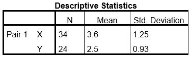

```{r, echo = FALSE, results = "hide"}
include_supplement("uu-Equation-808-nl-tabel.jpg", recursive = TRUE)
```


Question
========
  
De volgende beschrijvende statistitieken zijn beschikbaar voor twee variabelen X en Y: 



Verder weten we dat de correlatie tussen X en Y gelijk is aan r = +.87. Wat is de regressie¬vergelijking om Y te voorspellen aan de hand van X?
  
Answerlist
----------
* Ŷ = 0.65X + 0.17 
* Ŷ = 1.17X + 0.68
* Ŷ = 1.17X – 1.71
* Ŷ = 0.65X + 1.98


Solution
========
  


Meta-information
================
exname: uu-Equation-808-nl.Rmd
extype: schoice
exsolution: 1000
exsection: Inferential Statistics/Regression/Equation
exextra[ID]: f6a44
exextra[Type]: Interpretating output
exextra[Program]: SPSS
exextra[Language]: Dutch
exextra[Level]: Statistical Literacy
