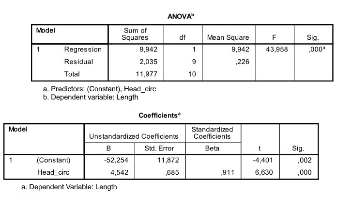

```{r, echo = FALSE, results = "hide"}
include_supplement("uu-Equation-809-nl-tabel.jpg", recursive = TRUE)
```

Question
========
  
A pediatrician would like to describe the relationship that may exist between children's height and head circumference. She is collecting data from some 3-year-old patients from her practice. Part of the SPSS output is below.



Which of the regression equations below describes the relationship between children's height and head circumference? 
Answerlist
----------
* Predicted head circumference = 4.542×Length - 52.254
* Predicted head circumference = -52.254×Length + 4.542
* Predicted length = 4.542×Head circumference -52.254
* Predicted length = -52.254×Head circumference + 4.542


Solution
========

Meta-information
================
exname: uu-Equation-809-en
extype: schoice
exsolution: 0010
exsection: Inferential Statistics/Regression/Equation
exextra[Type]: Interpretating output
exextra[Program]: SPSS
exextra[Language]: English
exextra[Level]: Statistical Literacy
