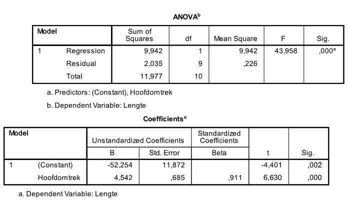

```{r, echo = FALSE, results = "hide"}
include_supplement("uu-Equation-809-nl-tabel.jpg", recursive = TRUE)
```


Question
========
  
Een kinderarts wil graag de relatie beschrijven die eventueel bestaat tussen de lengte van kinderen en hun hoofdomtrek. Ze verzamelt data van enkele 3-jarige patiënten van haar praktijk. Een deel van de SPSS-output staat hieronder.



Welk van de onderstaande regressievergelijkingen beschrijft de relatie tussen de lengte van kinderen en hun hoofdomtrek?
  
Answerlist
----------
* Voorspelde hoofdomtrek = 4.542×Lengte − 52.254
* Voorspelde hoofdomtrek = −52.254×Lengte + 4.542
* Voorspelde lengte = 4.542×Hoofdomtrek −52.254 
* Voorspelde lengte = −52.254×Hoofdomtrek + 4.542


Solution
========
  


Answerlist
----------


Meta-information
================
exname: uu-Equation-809-nl.Rmd
extype: schoice
exsolution: 0010
exsection: Inferential Statistics/Regression/Equation
exextra[Type]: Interpretating output
exextra[Program]: SPSS
exextra[Language]: Dutch
exextra[Level]: Statistical Literacy
