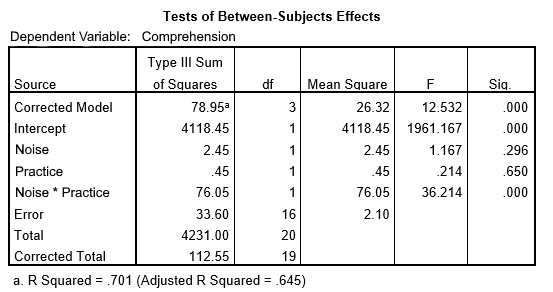

```{r, echo = FALSE, results = "hide"}
include_supplement("uu-Eta-squared-800-nl-tabel.jpg", recursive = TRUE)
```

Question
========
  
Research is conducted on the influence of background noise on text comprehension and understanding among 6 VWO students. It is decided to conduct an experiment. Half of the students are allowed to read through the text once beforehand (Variable practiced = 1) and the other half of the students see the text for the first time during the experiment (Variable practiced = 0). Students are divided equally between two noise conditions (a little vs. a lot). Part of the SPSS output is shown below. 



TRUE is the value of the effect size to be reported for the interaction effect? 
Answerlist
----------
* 70.1%
* 67.6%
* 1.8%
* 69.4% 


Solution
========

Meta-information
================
exname: uu-Eta-squared-800-en
extype: schoice
exsolution: 0001
exsection: Inferential Statistics/Effect size/Eta squared
exextra[ID]: 373d4
exextra[Type]: Calculation
exextra[Program]: SPSS
exextra[Language]: English
exextra[Level]: Statistical Literacy
