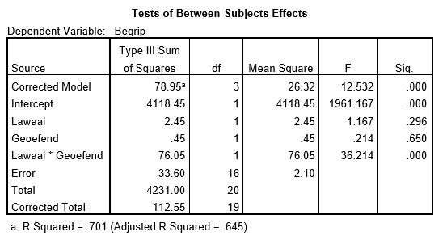

```{r, echo = FALSE, results = "hide"}
include_supplement("uu-Eta-squared-800-nl-tabel.jpg", recursive = TRUE)
```


Question
========
  
Er wordt onderzoek gedaan naar de invloed van achtergrondlawaai op het begrip van en inzicht in teksten bij leerlingen uit 6 VWO. Er wordt besloten een experiment uit te voeren. De helft van de leerlingen mag de tekst van te voren al een keer doorlezen (Variabele geoefend = 1) en de andere helft van de leerlingen zien de tekst voor het eerst tijdens het experiment (Variabele geoefend = 0). De leerlingen worden gelijk verdeeld over twee lawaaicondities (een beetje vs. heel veel). Een deel van de SPSS output staat hieronder. 



Wat is de waarde van de effectgrootte die gerapporteerd moet worden bij het interactie-effect?
  
Answerlist
----------
* 70.1%
* 67.6%
* 1.8%
* 69.4% 


Solution
========
  


Answerlist
----------


Meta-information
================
exname: uu-Eta-squared-800-nl.Rmd
extype: schoice
exsolution: 0001
exsection: Inferential Statistics/Effect size/Eta squared
exextra[Type]: Calculation
exextra[Program]: SPSS
exextra[Language]: Dutch
exextra[Level]: Statistical Literacy
