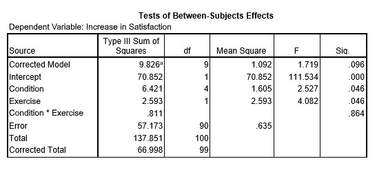

```{r, echo = FALSE, results = "hide"}
include_supplement("uu-Eta-squared-801-nl-tabel.jpg", recursive = TRUE)
```

Question
========

Wade et al. (2009) conducted a study that focused on the reducing women's dissatisfaction with body image. focus. One hundred first-year undergraduate students at Flinders University volunteered to participate and were then randomly assigned to five different conditions: condition focusing on Rumination (1), Cognitive Dissonance (2), Distraction (3), Acceptance (4), and a control group (5). One of the dependent variables is the increase in satisfaction with one's own weight.

Suppose researcher B is interested in exercise. A type of exercise is added to the half of the women in each condition add some type of exercise to their daily routine. The other half did nothing different than normal. The increase in satisfaction scores is compared not only between the five different conditions, but also between the two exercise groups. SPSS output from the analysis is below.



TRUE is the value of the effect size missing from the next report?

The analysis of variance showed that the main effect for condition was significant, $F(4, 90) = 2.527$, $p = .046$, $\eta^2 =$ . . . .


Answerlist
----------

* 0.096
* 0.047
* 0.101
* 0.717

Solution
========

Meta-information
================
exname: uu-Eta-squared-801-en
extype: schoice
exsolution: 0010
exsection: Inferential Statistics/Effect size/Eta squared
exextra[ID]: 4eea3
exextra[Type]: Calculation
exextra[Program]: SPSS
exextra[Language]: English
exextra[Level]: Statistical Literacy
