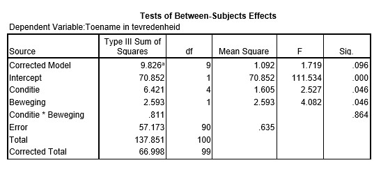

```{r, echo = FALSE, results = "hide"}
include_supplement("uu-Eta-squared-801-nl-tabel.jpg", recursive = TRUE)
```

Question
========

Wade et al. (2009) hebben een onderzoek uitgevoerd waarbij het
verminderen van de onvrede over het lichaamsbeeld bij vrouwen centraal
staat. Honderd eerstejaars studentes van de Flinders University hebben
zich aangemeld om mee te werken en werden vervolgens aselect in vijf
verschillende condities ingedeeld: conditie gericht op Rumineren (1),
Cognitieve Dissonantie (2), Afleiding (3), Acceptatie (4), en een
controlegroep (5). Een van de afhankelijke variabelen is de toename van
tevredenheid met het eigen gewicht.

Stel dat onderzoeker B geïnteresseerd is in beweging. Er wordt bij de
helft van de vrouwen in elke conditie een soort beweging toegevoegd aan
hun dagelijkse routine. De andere helft deed niks anders dan normaal. De
toename in tevredenheidscores wordt vergeleken niet alleen tussen de
vijf verschillende condities, maar ook tussen de twee bewegingsgroepen.
SPSS-output van de analyse staat hieronder.



Wat is de waarde van de effectgrootte die mist in de volgende rapportage?

Uit de variantieanalyse kwam naar voren dat het hoofdeffect voor conditie significant was, $F(4, 90) = 2.527$, $p = .046$, $\eta^2 =$ . . . .


Answerlist
----------

* 0.096
* 0.047
* 0.101
* 0.717

Solution
========


Meta-information
================
exname: uu-Eta-squared-801-nl.Rmd 
extype: schoice 
exsolution: 0010
exsection: Inferential Statistics/Effect size/Eta squared 
exextra[Type]: Calculation 
exextra[Program]: SPSS 
exextra[Language]: Dutch
exextra[Level]: Statistical Literacy
