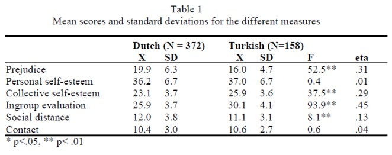

```{r, echo = FALSE, results = "hide"}
include_supplement("uu-F-statistic-800-nl-tabel.jpg", recursive = TRUE)
```

Question
========

The following table is taken from an article by Verkuyten & Masson.



Which statement is correct based on this data?

Answerlist
----------

* Dutch adolescents score significantly lower than Turkish adolescents on Personal Self-esteem and Contact.
* Dutch adolescents score significantly higher than Turkish adolescents on Personal Self-esteem and Contact.
* Dutch adolescents score significantly higher than Turkish adolescents on Prejudice and Social Distance.
* Dutch adolescents score significantly lower than Turkish adolescents on Prejudice and Social Distance.

Solution
========

Meta-information
================
exname: uu-F-statistic-800-en
extype: schoice
exsolution: 0010
exsection: Inferential Statistics/NHST/Test statistic/F-statistic
exextra[Type]: Interpretating output
exextra[Program]: SPSS
exextra[Language]: English
exextra[Level]: Statistical Literacy
