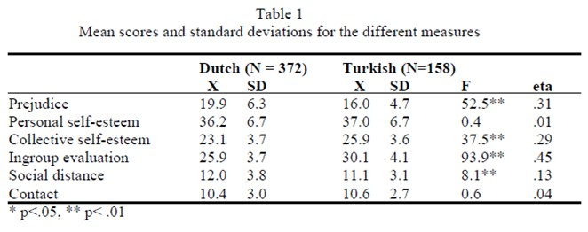

```{r, echo = FALSE, results = "hide"}
include_supplement("uu-F-statistic-800-nl-tabel.jpg", recursive = TRUE)
```

Question
========

De volgende tabel is afkomstig uit een artikel van Verkuyten & Masson.



Welke uitspraak is correct op basis van deze gegevens?

Answerlist
----------

* Nederlandse jongeren scoren significant lager dan Turkse jongeren op Personal Self-esteem en Contact.
* Nederlandse jongeren scoren significant hoger dan Turkse jongeren op Personal Self-esteem en Contact.
* Nederlandse jongeren scoren significant hoger dan Turkse jongeren op Prejudice en Social Distance.
* Nederlandse jongeren scoren significant lager dan Turkse jongeren op Prejudice en Social Distance.

Solution
========
  


Answerlist
----------


Meta-information
================

exname: uu-F-statistic-800-nl.Rmd 
extype: schoice 
exsolution: 0010
exsection: Inferential Statistics/NHST/Test statistic/F-statistic
exextra[Type]: Interpretating output 
exextra[Program]: SPSS
exextra[Language]: Dutch 
exextra[Level]: Statistical Literacy
