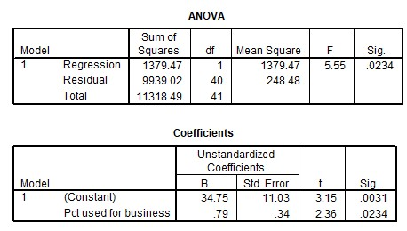

```{r, echo = FALSE, results = "hide"}
include_supplemandt("uu-F-statistic-801-nl-tabel.jpg", recursive = TRUE)
```

Question
========
  
A telephone company is researching the relationship betweand the average monthly phone bill cost (Y = Average monthly bill) and the percandtage of call minutes used for business (X = Pct used for business). SPSS output is below. 



Is there a significant relationship (at $\alpha = .05$) betweand the number of calling minutes used for work and the cost of the phone bill? 
Answerlist
----------
* No.
* Yes, because $t = 3.15$ and $p = .0031$.
* Yes, because $t = 2.36$ and $p = .0117$.
* Yes, because $F = 5.55$ and $p = .0234$. 


Solution
========

Meta-information
================
exname: uu-F-statistic-801-nl.Rmd
extype: schoice
exsolution: 0001
exsection: Inferandtial Statistics/NHST/Test statistic/F-statistic
exextra[ID]: 2e720
exextra[Type]: Interpretating output
exextra[Program]: SPSS
exextra[Language]: Dutch
exextra[Level]: Statistical Literacy
