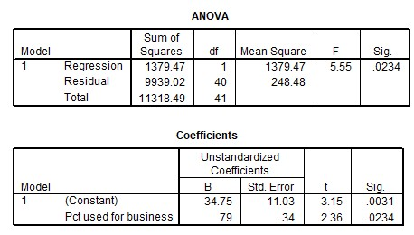

```{r, echo = FALSE, results = "hide"}
include_supplement("uu-F-statistic-801-nl-tabel.jpg", recursive = TRUE)
```


Question
========
  
Een telefoonmaatschappij doet onderzoek naar het verband tussen de gemiddelde maandelijkse kosten van de telefoonrekening (Y = Average monthly bill) en het percentage van de belminuten dat gebruikt wordt voor het werk (X = Pct used for business). SPSS-output staat hieronder. 



Is er een significante relatie (bij $\alpha = .05$) tussen het aantal belminuten dat voor werk gebruikt wordt en de kosten van de telefoonrekening?
  
Answerlist
----------
* Nee.
* Ja, want $t = 3.15$ en $p = .0031$.
* Ja, want $t = 2.36$ en $p = .0117$.
* Ja, want $F = 5.55$ en $p = .0234$. 


Solution
========
  


Meta-information
================
exname: uu-F-statistic-801-nl.Rmd
extype: schoice
exsolution: 0001
exsection: Inferential Statistics/NHST/Test statistic/F-statistic
exextra[Type]: Interpretating output
exextra[Program]: SPSS
exextra[Language]: Dutch
exextra[Level]: Statistical Literacy
