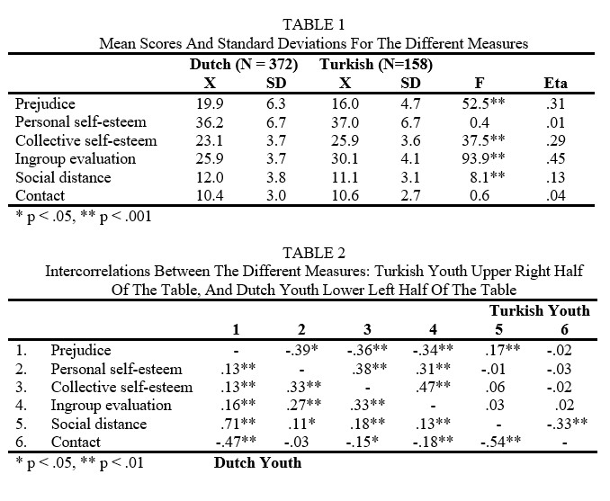

```{r, echo = FALSE, results = "hide"}
include_supplement("uu-F-statistic-804-nl-tabel.jpg", recursive = TRUE)
```

Question
========
  
The following two tables are taken (slightly adapted) from the article by Verkuyten and Masson. 



Suppose a reader draws the following two conclusions from this data:

1.  You can see from the F-value of 37.5 that Dutch and Turkish youths differ signficantly on Collective Self-Esteem. Turkish adolescents score higher than Dutch adolescents.

2.  From the F-value of 0.4 you can see that Dutch and Turkish youths signficantly differ on Personal self-esteem. Turkish adolescents score higher than Dutch adolescents.  Are these conclusions correct?

  
Answerlist
----------
* Only statement 1 is correct.
* Only statement 2 is correct.
* Both statements are correct.
* Both statements are incorrect.


Solution
========

Meta-information
================
exname: uu-F-statistic-804-en
extype: schoice
exsolution: 1000
exsection: Inferential Statistics/NHST/Test statistic/F-statistic
exextra[ID]: 444b8
exextra[Type]: Interpretating output
exextra[Program]: SPSS
exextra[Language]: English
exextra[Level]: Statistical Literacy
