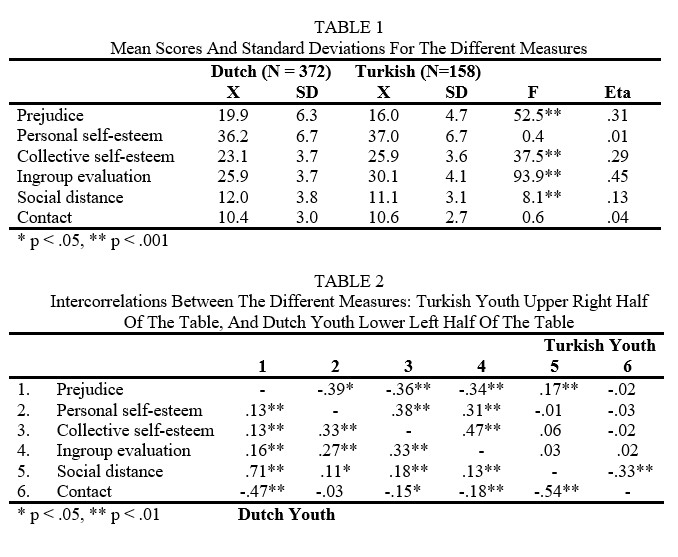

```{r, echo = FALSE, results = "hide"}
include_supplement("uu-F-statistic-804-nl-tabel.jpg", recursive = TRUE)
```


Question
========
  
De volgende twee tabellen zijn (enigszins aangepast) afkomstig uit het artikel van Verkuyten en Masson. 



Stel dat een lezer de volgende twee conclusies trekt uit deze gegevens:

1.  Aan de F-waarde van 37.5  kun je zien dat Nederlanders en Turkse jongeren  signficant verschillen op Collective Self-Esteem. Turkse jongeren scoren hoger dan  Nederlandse jongeren.

2.  Aan de F-waarde van 0.4 kun je zien dat Nederlanders en Turkse jongeren  signficicant verschillen op Personal self-esteem. Turkse jongeren scoren hoger dan  Nederlandse jongeren.
 
Zijn deze conclusies juist?

  
Answerlist
----------
* Alleen stelling 1 is juist.
* Alleen stelling 2 is juist.
* Beide stellingen zijn juist.
* Beide stelling zijn onjuist.


Solution
========
  

Meta-information
================
exname: uu-F-statistic-804-nl.Rmd
extype: schoice
exsolution: 1000
exsection: Inferential Statistics/NHST/Test statistic/F-statistic
exextra[ID]: 72ffa
exextra[Type]: Interpretating output
exextra[Program]: SPSS
exextra[Language]: Dutch
exextra[Level]: Statistical Literacy
