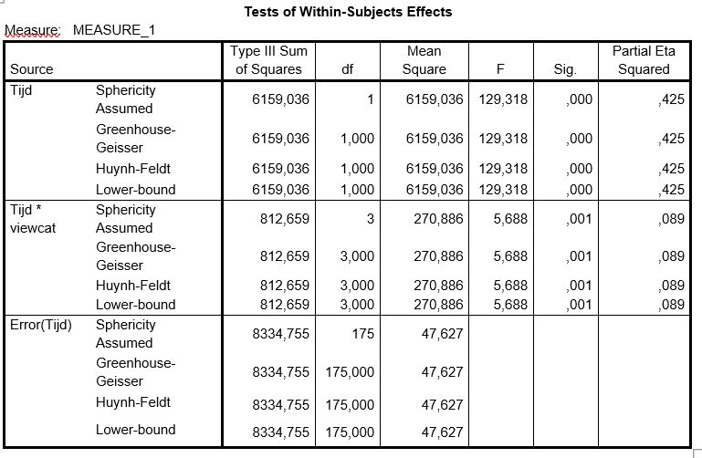

```{r, echo = FALSE, results = "hide"}
include_supplement("uu-F-statistic-805-nl-tabel.JPG", recursive = TRUE)
```


Question
========
  
A group of researchers examined the impact of watching Sesame Street on the development of number knowledge in young children.

Number knowledge was measured before children possibly started watching Sesame Street. One year after watching Sesame Street, knowledge of numbers was measured again.

The researchers compared four groups (viewcat) that differed in the frequency in which they watched Sesame Street: I. Watched rarely II. Watched once or twice a week III. Watched 3 to 5 times a week IV. Watched more than 5 times a week

The researchers' outputs include the following:


  
Which null hypothesis is tested with the test size F(3, 175) = 5.688?  
  
Answerlist
----------
* H0: the mean knowledge of numbers is the same in the four viewcat groups
* H0: the average knowledge of numbers is the same in the pre-measurement and post-measurement groups
* H0: the differences in knowledge of numbers in the pre- and post-measurement are the same in the four viewcat groups
* H0: the differences in knowledge of numbers in the pre-measurement and post-measurement are not equal in the four viewcat groups

Solution
========
  
The test magnitude F(3, 175) = 5.688 belongs in the table to the row 'Time* viewcat'. So this test looks both within groups (pre-measurement and post-measurement = variable time) and between groups (different types of viewing behavior = variable viewcat). Thus, this test looks at whether the differences in knowledge of numbers at pre-measurement and post-measurement differ across the four viewcat groups. The hypothesis associated with this test is thus: H0: the differences in knowledge of numbers at pre-measurement and post-measurement are the same in the four viewcat groups.

Answerlist
----------
* This answer is incorrect.
* This answer is incorrect.
* This answer is correct.
* This answer is incorrect.

Meta-information
================
exname: uu-F-statistic-805-en
extype: schoice
exsolution: 0010
exsection: Inferential Statistics/NHST/Test statistic/F-statistic
exextra[ID]: 462fc
exextra[Type]: Interpretating output
exextra[Program]: SPSS
exextra[Language]: English
exextra[Level]: Statistical Literacy