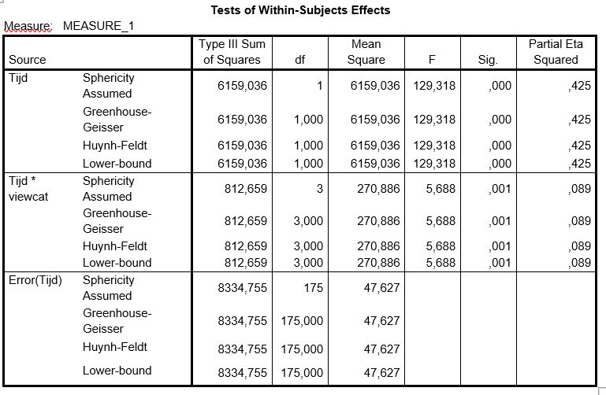

```{r, echo = FALSE, results = "hide"}
include_supplement("uu-F-statistic-805-nl-tabel.JPG", recursive = TRUE)
```


Question
========
  
Een groep onderzoekers heeft onderzocht wat de invloed van het kijken van Sesamstraat is op de ontwikkeling van kennis van getallen bij jonge kinderen.

De kennis van getallen is gemeten voordat de kinderen eventueel naar Sesamstraat gingen kijken. Een jaar na het kijken naar Sesamstraat is de kennis van getallen nogmaals gemeten.

De onderzoekers vergelijken vier groepen (viewcat) die verschillen in de frequentie waarin zij Sesamstraat hebben gekeken:
I. Keek zelden 
II. Keek 1 à 2 keer per week
III. Keek 3 à 5 keer per week
IV. Keek meer dan 5 keer per week

De onderzoekers krijgen onder andere de volgende output:


  
Welke nul-hypothese wordt getoetst met de toetsingsgrootheid F(3, 175) = 5.688?  
  
Answerlist
----------
* H0: de gemiddelde kennis van getallen is gelijk in de vier viewcat-groepen
* H0: de gemiddelde kennis van getallen is gelijk bij de voormeting en de nameting
* H0: de verschillen in kennis van getallen bij de voormeting en de nameting zijn gelijk in de vier viewcat-groepen
* H0: de verschillen in kennis van getallen bij de voormeting en de nameting zijn niet gelijk in de vier viewcat-groepen

Solution
========
  
De toetsingsgrootheid F(3, 175) = 5.688 hoort in de tabel bij de rij ‘Tijd* viewcat’. Deze toets kijkt dus zowel binnen groepen (voormeting en nameting =  variabele tijd) als tussen groepen (verschillende typen kijkgedrag = variabele viewcat). Er wordt bij deze toets dus gekeken of de verschillen in kennis van getallen bij de voormeting en de nameting verschillen in de vier viewcat-groepen. De hypothese die bij deze toets hoort is daarmee: H0: de verschillen in kennis van getallen bij de voormeting en de nameting zijn gelijk in de vier viewcat-groepen. 

Answerlist
----------
* Dit antwoord is incorrect.
* Dit antwoord is incorrect.
* Dit antwoord is correct.
* Dit antwoord is incorrect.

Meta-information
================
exname: uu-F-statistic-805-nl.Rmd
extype: schoice
exsolution: 0010
exsection: Inferential Statistics/NHST/Test statistic/F-statistic
exextra[ID]: 85894
exextra[Type]: Interpretating output
exextra[Program]: SPSS
exextra[Language]: Dutch 
exextra[Level]: Statistical Literacy