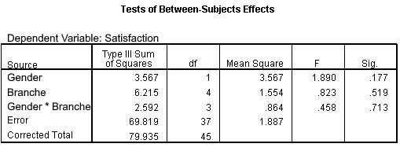

```{r, echo = FALSE, results = "hide"}
include_supplement("uu-F-statistic-806-nl.png", recursive = TRUE)
```

Question
========
  
The manager of a large company with 5 different branches has asked his employees to complete a questionnaire on job satisfaction and working conditions (5 point Likert scale). The manager would like to know if there are differences between male and female employees within the five branches.




Which null hypothesis tests the test size F = 0.458? 
Answerlist
----------
* H0: the average satisfaction scores of men and women are equal
* H0: the average satisfaction scores within the five sites are equal
* H0: the differences (if any) in average satisfaction scores between men and women are equal for all five establishments.
* H0: the differences (if any) in average satisfaction scores between the five establishments are different for men and women.

Solution
========

Answerlist
----------
* This answer is incorrect.
* This answer is incorrect.
* This answer is correct.
* This answer is incorrect.

Meta-information
================
exname: uu-F-statistic-806-en
extype: schoice
exsolution: 0100
exsection: Inferential Statistics/NHST/Test statistic/F-statistic
exextra[ID]: c5b19
exextra[Type]: Interpretating output
exextra[Program]: SPSS
exextra[Language]: English
exextra[Level]: Statistical Literacy