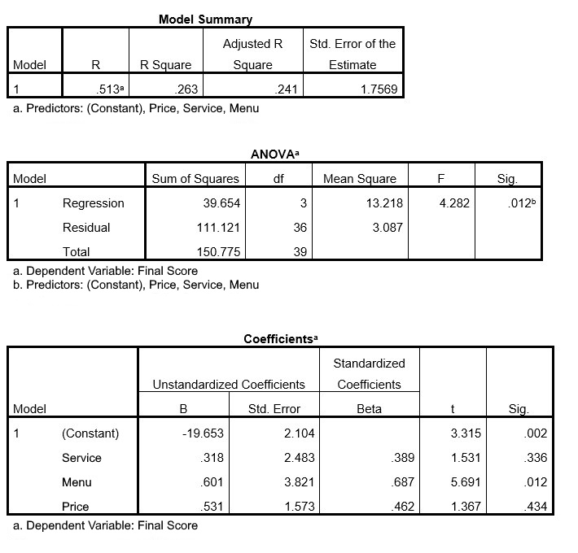
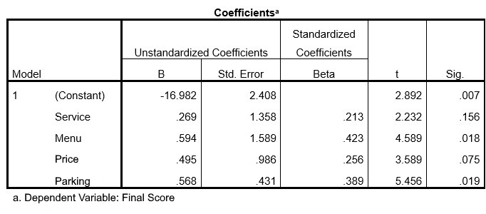
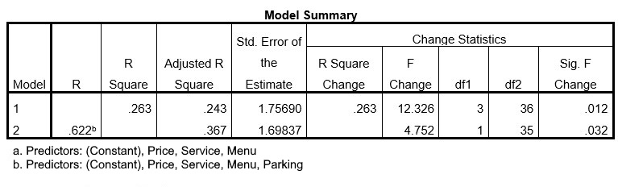

```{r, echo = FALSE, results = "hide"}
include_supplement("uu-F-test-for-comparing-nested-models-800-nl-tabel.jpg", recursive = TRUE)
```

```{r, echo = FALSE, results = "hide"}
include_supplement("uu-F-test-for-comparing-nested-models-800-nl-tabel2.jpg", recursive = TRUE)
```

```{r, echo = FALSE, results = "hide"}
include_supplement("uu-F-test-for-comparing-nested-models-800-nl-tabel3.jpg", recursive = TRUE)
```

Question
========
Marco, a culinary specialist from Utrecht, would like to give a good advice for the customers of his magazine about the price/quality ratio of various restaurants in Utrecht based on the year 2014. To this end, he has had 40 restaurants rated by his readers and has collected data on a number of indicators: price for a 3-course menu (in whole euros), quality score of the menu according to readers (1-10) and quality score for the service according to readers (1-10). He himself assigned his own final rating to these restaurants (variable = final score (1-10)). He is building a regression model to predict the final score using the price and the two readers' ratings. He is very curious how far the predicted scores will deviate from his own judgment. Below is part of the SPSS output.




Marco notes that many of the restaurants he rates highly are downtown. Yet many of his readers are reluctant to visit there because parking is often poor or expensive. He decides to include an additional predictor in his model: free parking (No = 0, Yes = 1). See below part of the updated output.



How much higher does a restaurant that offers free parking score than a restaurant that does not offer free parking?

After adding this predictor, Marco wonders if it really made the model significantly better. He compares the two models in the analysis below:



Answerlist
----------
* 38.8%, the change is significant
* 38.8%, the change is not significant
* 12.4%, the change is significant
* 12.4%, the change is not significant


Solution
========

Meta-information
================
exname: uu-F-test for comparing nested models-800-en
extype: schoice
exsolution: 0010
exsection: Inferential Statistics/Regression/Multiple linear regression/F-test for comparing (nested) models
exextra[Type]: Interpretating output
exextra[Program]: SPSS
exextra[Language]: English
exextra[Level]: Statistical Literacy