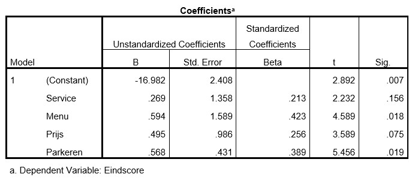
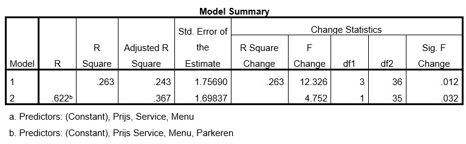

```{r, echo = FALSE, results = "hide"}
include_supplement("uu-F-test-for-comparing-nested-models-800-nl-tabel.jpg", recursive = TRUE)
```

```{r, echo = FALSE, results = "hide"}
include_supplement("uu-F-test-for-comparing-nested-models-800-nl-tabel2.jpg", recursive = TRUE)
```

```{r, echo = FALSE, results = "hide"}
include_supplement("uu-F-test-for-comparing-nested-models-800-nl-tabel3.jpg", recursive = TRUE)
```

Question
========
Marco, een culinair specialist uit Utrecht, wil voor de klanten van zijn magazine graag een goed advies uitbrengen over de prijs/kwaliteit verhouding van diverse restaurants in Utrecht gebaseerd op het jaar 2014. Hij heeft daarvoor 40 restaurants door zijn lezers laten beoordelen en heeft over een aantal indicatoren data verzameld: prijs voor een 3-gangen menu (in hele euro’s), kwaliteitsscore van het menu volgens lezers (1-10) en kwaliteitsscore voor de service volgens lezers (1-10). Zelf heeft hij een eigen eindoordeel aan deze restaurants toegekend (variabele = eindscore (1-10)). Hij bouwt een regressiemodel om de eindscore te voorspellen a.d.h.v. de prijs en de twee beoordelingen van de lezers. Hij is erg benieuwd hoe ver de voorspelde scores af zullen wijken van zijn eigen oordeel. 
Hieronder staat een deel van de SPSS output.


Marco merkt op dat veel van de restaurants die hij hoog waardeert in de binnenstad zitten. Toch komen veel van zijn lezers daar niet graag, omdat de parkeergelegenheid vaak slecht of duur is. Hij besluit een extra predictor op te nemen in zijn model: Gratis parkeermogelijkheid (Nee = 0, Ja = 1). Zie hieronder een deel van de vernieuwde output.



Hoeveel hoger scoort een restaurant dat gratis parkeergelegenheid biedt dan een restaurant dat geen gratis parkeergelegenheid biedt?

Na het toevoegen van deze predictor, vraagt Marco zich af of het model er wel echt significant beter van is geworden. Hij vergelijkt beide modellen in onderstaande analyse:



Answerlist
----------
* 38.8%, de verandering is significant
* 38.8%, de verandering is niet significant
* 12.4%, de verandering is significant
* 12.4%, de verandering is niet significant


Solution
========


Meta-information
================
exname: uu-F-test for comparing nested models-800-nl
extype: schoice
exsolution: 0010
exsection: Inferential Statistics/Regression/Multiple linear regression/F-test for comparing (nested) models
exextra[ID]: c72cf
exextra[Type]: Interpretating output
exextra[Program]: SPSS
exextra[Language]: Dutch
exextra[Level]: Statistical Literacy