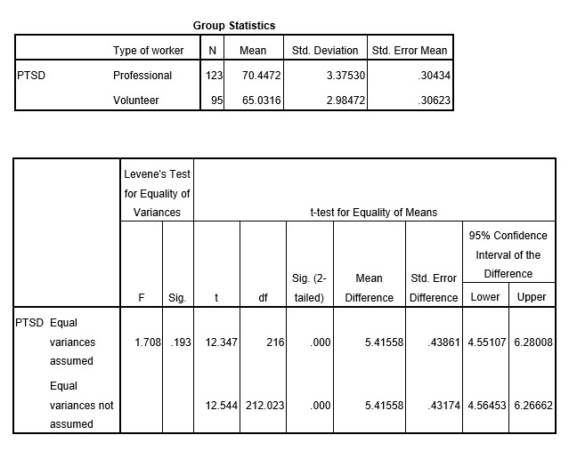

```{r, echo = FALSE, results = "hide"}
include_supplement("uu-Hypothesis-808-en-tabel.jpg", recursive = TRUE)
```


Question
========
  
A team of researchers is interested in post-traumatic stress symptoms experienced by rescue workers after a major earth quake. They want to investigate if volunteer rescue workers experience higher levels of PTSD than members of professional rescue squads. Three weeks after the earthquake, 95 volunteers and 123 professional rescue workers completed a questionnaire in which PTSD symptoms were measured on a scale from 0 to 100.

They find the following results:




What are the research hypothesis (HR) and the null hypothesis (H0) of this study?
  
Answerlist
----------
* HR: There is no difference in PTSD levels between volunteers and professional rescue workers. H0: There is a difference in PTSD levels between volunteers and professional rescue workers.
* HR: There is an increase in PTSD-levels between professional rescue workers and volunteers. H0: There is no increase in PTSD levels between professional rescue workers and volunteers.
* HR: There is a difference in PTSD levels between volunteers and professional rescue workers. H0: There is no difference in PTSD levels between volunteers and professional rescue workers.
* HR: Volunteers experience higher levels of PTSD than professional rescue workers. H0: Volunteers do not experience higher levels of PTSD than professional rescue workers.


Solution
========
  


Meta-information
================
exname: uu-Hypothesis-808-en.Rmd
extype: schoice
exsolution: 0001
exsection: Inferential Statistics/NHST/Hypothesis
exextra[ID]: 70024
exextra[Type]: Case
exextra[Program]: SPSS
exextra[Language]: English
exextra[Level]: Statistical Literacy
