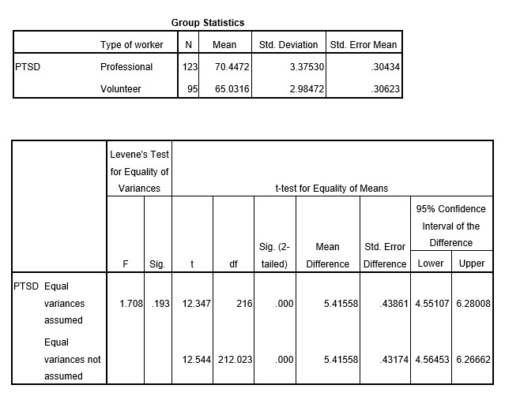

```{r, echo = FALSE, results = "hide"}
include_supplement("uu-Hypothesis-808-en-tabel.jpg", recursive = TRUE)
```

Question
========
  
Een team onderzoekers is geïnteresseerd in posttraumatische stresssymptomen die reddingswerkers ervaren na een zware aardbeving. Ze willen onderzoeken of vrijwillige reddingswerkers hogere niveaus van PTSS ervaren dan leden van professionele reddingsploegen. Drie weken na de aardbeving vulden 95 vrijwilligers en 123 professionele reddingswerkers een vragenlijst in waarin PTSS-symptomen werden gemeten op een schaal van 0 tot 100.

Ze vonden de volgende resultaten:




Wat zijn de onderzoekshypothese (HR) en de nulhypothese (H0) van dit onderzoek? 
Answerlist
----------
* HR: Er is geen verschil in PTSS-niveaus tussen vrijwilligers en professionele hulpverleners. H0: Er is een verschil in PTSS-niveaus tussen vrijwilligers en professionele hulpverleners.
* HR: Er is een toename in PTSS-niveaus tussen professionele hulpverleners en vrijwilligers. H0: Er is geen toename in PTSS-niveaus tussen professionele hulpverleners en vrijwilligers.
* HR: Er is een verschil in PTSS-niveaus tussen vrijwilligers en professionele hulpverleners. H0: Er is geen verschil in PTSS-niveaus tussen vrijwilligers en professionele hulpverleners.
* HR: Vrijwilligers ervaren hogere niveaus van PTSS dan professionele hulpverleners. H0: Vrijwilligers ervaren geen hogere niveaus van PTSS dan professionele hulpverleners.


Solution
========

Meta-information
================
exname: uu-Hypothesis-808-nl
extype: schoice
exsolution: 0001
exsection: Inferential Statistics/NHST/Hypothesis
exextra[Type]: Case
exextra[Program]: SPSS
exextra[Language]: Dutch
exextra[Level]: Statistical Literacy
