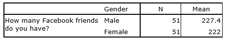

```{r, echo = FALSE, results = "hide"}
include_supplement("uu-Independent-samples-means-603-en-tabel.jpg", recursive = TRUE)
```


Question
========
For a social science project, you would like to study the communication patterns of university students. One of your research questions is: Do male students have more Facebook friends than female students?

You find the following results:




SPSS also indicates that the variance of the distribution of differences between means ($S^2_{\text{Difference}}$) equals 9. 

What is the answer to the research question? Show your work. 


  
Answerlist
----------


Solution
========
  
1. $H_0: \mu_m = \mu_f$ and $H_{A}: \mu_m > \mu_f$
2. $\alpha=.05$, $df_{Total} = 51+51-2=100$, cut-off $=1.660$
4. $t= \frac {227.4-222}{\sqrt {9 (1/51 + 1/51)} } = 9.09$ 
5. We can reject $H_0$ and conclude that the average number of friends for male students is higher than for female students.


Meta-information
================
exname: uu-Independent-samples-means-603-en.Rmd
extype: string
exsolution: na
exsection: Inferential Statistics/Parametric Techniques/t-test/Independent samples means
exextra[Type]: Case
exextra[Language]: English