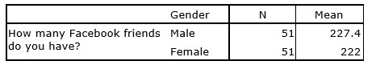

```{r, echo = FALSE, results = "hide"}
include_supplement("uu-Independent-samples-means-603-en-tabel.jpg", recursive = TRUE)
```

Question
========
Voor een sociaalwetenschappelijk project wil je de communicatiepatronen van universiteitsstudenten bestuderen. Een van je onderzoeksvragen is: Hebben mannelijke studenten meer Facebookvrienden dan vrouwelijke studenten?

U vindt de volgende resultaten:




SPSS geeft ook aan dat de variantie van de verdeling van verschillen tussen gemiddelden ($S^2_{\text{Difference}}$) is gelijk aan 9.

Wat is het antwoord op de onderzoeksvraag? Laat je werk zien.


  
Antwoordenlijst
----------


Solution
========
  
1. $H_0: \mu_m = \mu_f$ en $H_{A}: \mu_m > \mu_f$
2. $\alpha=.05$, $df_{Total} = 51+51-2=100$afsnijding $=1.660$
4. $t= \frac {227.4-222}{\sqrt {9 (1/51 + 1/51)} } = 9.09$ 
5. We kunnen $H_0$ en conclude that the average number of friends for male students is higher than for female students.

Meta-information
================
exname: uu-Independent-samples-means-603-nl
extype: string
exsolution: na
exsection: Inferential Statistics/Parametric Techniques/t-test/Independent samples means
exextra[Type]: Case
exextra[Language]: Dutch