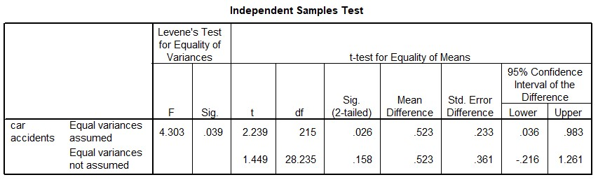

```{r, echo = FALSE, results = "hide"}
include_supplement("uu-Independent-samples-means-802-nl-tabel.jpg", recursive = TRUE)
```

Question
========
  
In a study of the effect of preferred hand on driving ability, 217 subjects were randomly drawn from the population of car drivers who were followed for 2 years. During that period, the 27 left-handed subjects made an average of 1.3 car accidents and the 190 right-handed subjects made 0.77 car accidents. Based on these data, a two-sided t-test for two independent groups was performed with α = 5%. What do you conclude from the SPSS output shown below regarding equality of variances and significance of the effect of preferred hand on the number of accidents? 



  
Answerlist
----------
* The variances are equal and left-handers make significantly more accidents.
* The variances are equal and left-handers do not make significantly more accidents.
* The variances are unequal and left-handers make significantly more accidents.
* The variances are unequal and left-handed people do not make significantly more accidents.

Solution
========

Meta-information
================
exname: uu-Independent-samples-means-802-en
extype: schoice
exsolution: 0001
exsection: Inferential Statistics/Parametric Techniques/t-test/Independent samples means
exextra[Type]: Interpretating output
exextra[Language]: English
exextra[Level]: Statistical Literacy
