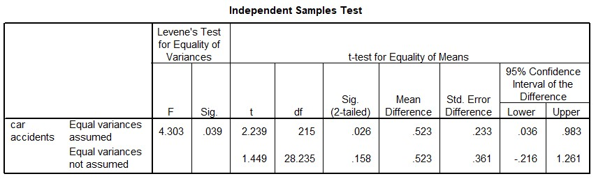

```{r, echo = FALSE, results = "hide"}
include_supplement("uu-Independent-samples-means-802-nl-tabel.jpg", recursive = TRUE)
```


Question
========
  
In een onderzoek naar het effect van voorkeurshand op de rijvaardigheid zijn aselect 217 proefpersonen uit de populatie autobestuurders getrokken welke gedurende 2 jaar zijn gevolgd. In die periode maken de 27 linkshandige proefpersonen gemiddeld 1.3 auto-ongelukken en de 190 rechtshandige proefpersonen 0.77 auto-ongelukken. Op basis deze gegevens is een tweezijdige t-toets voor twee onafhankelijke groepen uitgevoerd met α = 5%. Wat concludeer je uit de hieronder getoonde SPSS output ten aanzien van gelijkheid van de varianties en de significantie van het effect van voorkeurshand op het aantal ongelukken? 



  
Answerlist
----------
* De varianties zijn gelijk en linkshandigen maken significant meer ongelukken. 
* De varianties zijn gelijk en linkshandigen maken niet significant meer ongelukken.
* De varianties zijn ongelijk en linkshandigen maken significant meer ongelukken.
* De varianties zijn ongelijk en linkshandigen maken niet significant meer ongelukken.


Solution
========
  


Meta-information
================
exname: uu-Independent-samples-means-802-nl.Rmd
extype: schoice
exsolution: 0001
exsection: Inferential Statistics/Parametric Techniques/t-test/Independent samples means
exextra[Type]: Interpretating output
exextra[Language]: Dutch
exextra[Level]: Statistical Literacy
