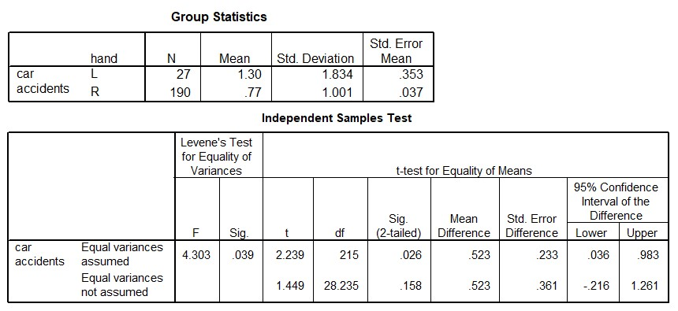

```{r, echo = FALSE, results = "hide"}
include_supplement("uu-Independent-samples-means-803-nl-tabel.jpg", recursive = TRUE)
```

Question
========
  
A study was conducted to find out whether the number of car accidents differed for left-handed (L) and right-handed (R) people. Based on a sample of 217 people, a two-sided t-test for two independent groups was performed with α = 5%. Below are two statements. Which of these statements is/are correct?

I.   Homogeneity assumption is met. II.  Left-handed people have significantly more accidents than right-handed people.



  
Answerlist
----------
* Pronunciation I is correct, pronunciation II is incorrect.
* Utterance I is incorrect, utterance II is correct.
* Both utterances are correct.
* Both statements are incorrect. 


Solution
========

Meta-information
================
exname: uu-Independent-samples-means-803-en
extype: schoice
exsolution: 0001
exsection: Inferential Statistics/Parametric Techniques/t-test/Independent samples means
exextra[ID]: 306af
exextra[Type]: Interpretating output
exextra[Program]: SPSS
exextra[Language]: English
exextra[Level]: Statistical Literacy
