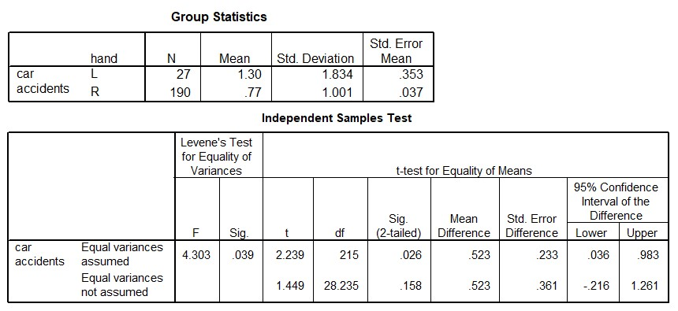

```{r, echo = FALSE, results = "hide"}
include_supplement("uu-Independent-samples-means-803-nl-tabel.jpg", recursive = TRUE)
```


Question
========
  
In een onderzoek is uitgezocht of het aantal auto-ongelukken voor linkshandigen (L) en rechtshandigen (R) verschilt. Op basis van een steekproef van 217 personen is een tweezijdige t-toets voor twee onafhankelijke groepen uitgevoerd met α = 5%. Hieronder staan twee uitspraken. Welke van deze uitspraken is/zijn correct?

I.   Er is aan de homogeniteitsassumptie voldaan. 
II.  Linkshandigen maken significant meer ongelukken dan rechtshandigen.



  
Answerlist
----------
* Uitspraak I is correct, uitspraak II is incorrect. 
* Uitspraak I is incorrect, uitspraak II is correct. 
* Beide uitspraken zijn correct. 
* Beide uitspraken zijn incorrect. 


Solution
========
  


Meta-information
================
exname: uu-Independent-samples-means-803-nl.Rmd
extype: schoice
exsolution: 0001
exsection: Inferential Statistics/Parametric Techniques/t-test/Independent samples means
exextra[ID]: a59e4
exextra[Type]: Interpretating output
exextra[Program]: SPSS
exextra[Language]: Dutch
exextra[Level]: Statistical Literacy
