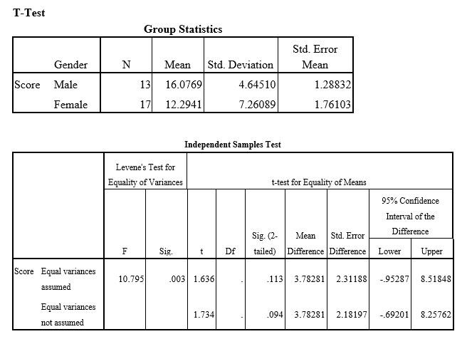

```{r, echo = FALSE, results = "hide"}
include_supplement("uu-Independent-samples-means-806-en-tabel.jpg", recursive = TRUE)
```


Question
========
  
A researcher expects male students to perform better on a given test than female students. To investigate this, he invites 13 males and 17 females to do a mathematical test. All participants make exactly the same test and are given all the time they need to complete it. The researcher then scores the correct answers and executes a t-test in SPSS. The output of the SPSS analysis of this test is below.


  
Answerlist
----------
* Cutoff = 1.701 with 28 degrees of freedom
* Cutoff = 1.699 with 29 degrees of freedom
* Cutoff = 2.049 with 28 degrees of freedom
* Cutoff = 2.045 with 29 degrees of freedom

Solution
========
  


Answerlist
----------


Meta-information
================
exname: uu-Independent-samples-means-806-en.Rmd
extype: schoice
exsolution: 1000
exsection: Inferential Statistics/Parametric Techniques/t-test/Independent samples means
exextra[Type]: Interpretating output
exextra[Program]: SPSS
exextra[Language]: English
exextra[Level]: Statistical Literacy
