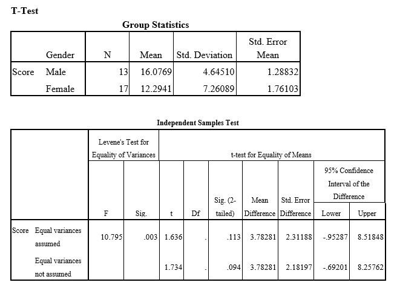

```{r, echo = FALSE, results = "hide"}
include_supplement("uu-Independent-samples-means-806-en-tabel.jpg", recursive = TRUE)
```

Question
========
  
Een onderzoeker verwacht dat mannelijke studenten beter presteren op een bepaalde test dan vrouwelijke studenten. Om dit te onderzoeken nodigt hij 13 mannen en 17 vrouwen uit om een wiskundige test te maken. Alle deelnemers maken exact dezelfde test en krijgen alle tijd die ze nodig hebben. De onderzoeker scoort vervolgens de juiste antwoorden en voert een t-test uit in SPSS. De uitvoer van de SPSS-analyse van deze test staat hieronder.


  
Answerlist
----------
* Cutoff = 1,701 met 28 vrijheidsgraden
* Afkappunt = 1,699 met 29 vrijheidsgraden
* Afkappunt = 2,049 met 28 vrijheidsgraden
* Afkappunt = 2,045 met 29 vrijheidsgraden

Solution
========

Meta-information
================
exname: uu-Independent-samples-means-806-nl
extype: schoice
exsolution: 1000
exsection: Inferential Statistics/Parametric Techniques/t-test/Independent samples means
exextra[Type]: Interpretating output
exextra[Program]: SPSS
exextra[Language]: Dutch
exextra[Level]: Statistical Literacy
