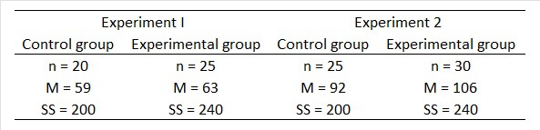

```{r, echo = FALSE, results = "hide"}
include_supplement("uu-Independent-samples-means-808-nl-tabel.jpg", recursive = TRUE)
```

Question
========
  
The table below shows the results of two experiments, each with an experimental group and a control group. In which experiment is a significant result most likely?


  
Answerlist
----------
* In experiment I.
* In experiment II.  
* For both experiments equally likely.
* This question cannot be answered because the power of the test is not known.


Solution
========

Meta-information
================
exname: uu-Independent-samples-means-808-en
extype: schoice
exsolution: 0100
exsection: Inferential Statistics/Parametric Techniques/t-test/Independent samples means
exextra[ID]: ca734
exextra[Type]: Case
exextra[Language]: English
exextra[Level]: Statistical Literacy
