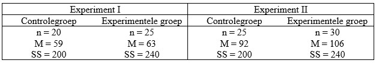

```{r, echo = FALSE, results = "hide"}
include_supplement("uu-Independent-samples-means-808-nl-tabel.jpg", recursive = TRUE)
```


Question
========
  
In de onderstaande tabel staan de resultaten van twee experimenten, elk met een experimentele groep en een controlegroep. Bij welk experiment is een significant resultaat het meest aannemelijk?


  
Answerlist
----------
* Bij experiment I. 
* Bij experiment II.  
* Voor beide experimenten even waarschijnlijk. 
* Deze vraag kan niet worden beantwoord, want de power van de toets is niet bekend.


Solution
========
  


Answerlist
----------


Meta-information
================
exname: uu-Independent-samples-means-808-nl.Rmd
extype: schoice
exsolution: 0100
exsection: Inferential Statistics/Parametric Techniques/t-test/Independent samples means
exextra[Type]: Case
exextra[Language]: Dutch
exextra[Level]: Statistical Literacy
