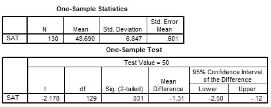

```{r, echo = FALSE, results = "hide"}
include_supplement("uu-Independent-samples-means-810-nl-tabel.jpg", recursive = TRUE)
```

Question
========
  
The Minister of Education wants to find out whether high school students today have lower SAT scores on a writing test than students 10 years ago, when the national average was 50. The minister will have a sample of 130 high school students take the same writing test and administer a one-sided test with $\alpha$ = 5%. Evaluate the two statements below based on the SPSS output. Which of these statements is/are correct?




I.   The average SAT score of the students is between
-2.5 and -0.12. II.  Current SAT scores are significantly below 50 on average.

  
Answerlist
----------
* Pronunciation I is correct, pronunciation II is incorrect.
* Utterance I is incorrect, utterance II is correct.
* Both utterances are correct.
* Both statements are incorrect. 

Solution
========

Meta-information
================
exname: uu-Independent-samples-means-810-en
extype: schoice
exsolution: 0100
exsection: Inferential Statistics/Parametric Techniques/t-test/Independent samples means
exextra[Type]: Case
exextra[Language]: English
exextra[Level]: Statistical Literacy
