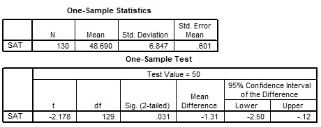

```{r, echo = FALSE, results = "hide"}
include_supplement("uu-Independent-samples-means-810-nl-tabel.jpg", recursive = TRUE)
```


Question
========
  
De minister van onderwijs wil nagaan of middelbare scholieren tegenwoordig een lagere SAT-score halen op een schrijfvaardigheidstest dan scholieren van 10 jaar geleden, toen het landelijk gemiddelde op 50 lag. De minister laat een steekproef van 130 scholieren dezelfde schrijfvaardigheidstest maken en voert een eenzijdige toets uit met $\alpha$ = 5%. Beoordeel de onderstaande twee uitspraken op basis van de SPSS-output. Welke van deze uitspraken is/zijn correct?




I.   De gemiddelde SAT-score van de leerlingen ligt met 95% zekerheid tussen 
-2.5 en -0.12. 
II.  De huidige SAT-scores zijn gemiddeld significant lager dan 50.

  
Answerlist
----------
* Uitspraak I is correct, uitspraak II is incorrect. 
* Uitspraak I is incorrect, uitspraak II is correct. 
* Beide uitspraken zijn correct. 
* Beide uitspraken zijn incorrect. 


Solution
========
  


Meta-information
================
exname: uu-Independent-samples-means-810-nl.Rmd
extype: schoice
exsolution: 0100
exsection: Inferential Statistics/Parametric Techniques/t-test/Independent samples means
exextra[ID]: 5f41c
exextra[Type]: Case
exextra[Language]: Dutch
exextra[Level]: Statistical Literacy
