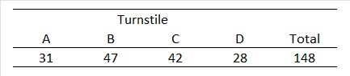

```{r, echo = FALSE, results = "hide"}
include_supplement("uu-Independent-samples-means-811-nl-tabel.jpg", recursive = TRUE)
```

```{r, echo = FALSE, results = "hide"}
include_supplement("uu-Independent-samples-means-811-nl-tabel2.jpg", recursive = TRUE)
```

Question
========
  
In a large amusement park, there are four turnstiles at the entrance. To see if the four turnstiles are all used equally, cameras are installed at the entrance. The number of people entering through each gate is counted over a 15-minute period. The table below shows the data collected. 



The director of the amusement park wants to test the following hypotheses: H0: there is no preference for a particular turnstile H1: certain turnstile(s) are used more than others

What is the value of the test size to test these hypotheses?

  
Answerlist
----------
* 0.81
* 6.54
* 6.78
* 37.0


Solution
========
  


Meta-information
================
exname: uu-Independent-samples-means-811-en
extype: schoice
exsolution: 0100
exsection: Inferential Statistics/Parametric Techniques/t-test/Independent samples means
exextra[ID]: fa1cb
exextra[Type]: Case
exextra[Language]: English
exextra[Level]: Statistical Literacy
