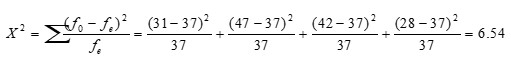

```{r, echo = FALSE, results = "hide"}
include_supplement("uu-Independent-samples-means-811-nl-tabel.jpg", recursive = TRUE)
```

```{r, echo = FALSE, results = "hide"}
include_supplement("uu-Independent-samples-means-811-nl-tabel2.jpg", recursive = TRUE)
```

Question
========
  
In een groot pretpark staan vier draaihekjes bij de ingang. Om te kijken of de vier draaihekjes allemaal evenveel gebruikt worden, worden camera’s geïnstalleerd bij de ingang. Het aantal mensen dat door ieder hekje naar binnen gaat wordt geteld gedurende een periode van 15 minuten. De onderstaande tabel toont de verzamelde data. 


De directeur van het pretpark wil de volgende hypotheses toetsen:
H0: er is geen voorkeur voor een bepaald draaihekje 
H1: bepaalde draaihekje(s) worden meer gebruikt dan anderen

Wat is de waarde van de toetsingsgrootheid om deze hypotheses te toetsen?

  
Answerlist
----------
* 0.81
* 6.54  
* 6.78
* 37.0


Solution
========
  


Meta-information
================
exname: uu-Independent-samples-means-811-nl.Rmd
extype: schoice
exsolution: 0100
exsection: Inferential Statistics/Parametric Techniques/t-test/Independent samples means
exextra[Type]: Case
exextra[Language]: Dutch
exextra[Level]: Statistical Literacy
