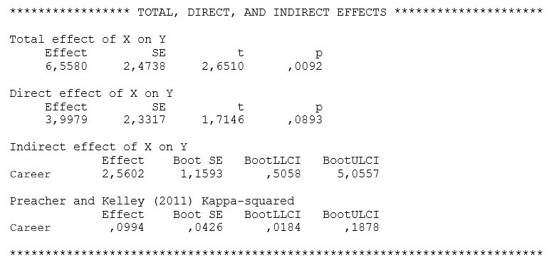

```{r, echo = FALSE, results = "hide"}
include_supplement("uu-Mediation-806-nl-tabel.jpg", recursive = TRUE)
```


Question
========
An occupational psychologist examines whether the effect of age on employability is through career competencies. The occupational psychologist's outputs include the following:




Answerlist
----------
* There is full mediation
* There is partial mediation
* There is no mediation
* No conclusion can be drawn about mediation based on the output.


Solution
========

Meta-information
================
exname: uu-Mediation-806-en
extype: schoice
exsolution: 1000
exsection: Inferential Statistics/Regression/Multiple linear regression/Mediation
exextra[ID]: 3ced9
exextra[Type]: Interpretating output
exextra[Program]: SPSS
exextra[Language]: English
exextra[Level]: Statistical Literacy