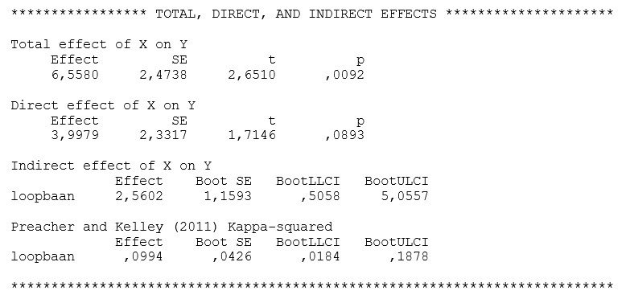

```{r, echo = FALSE, results = "hide"}
include_supplement("uu-Mediation-806-nl-tabel.jpg", recursive = TRUE)
```


Question
========
Een arbeidspsycholoog onderzoekt of het effect van leeftijd op employability verloopt via loopbaancompetenties. 
De arbeidspsycholoog krijgt onder andere de volgende output:




Answerlist
----------
* Er is sprake van volledige mediatie
* Er is sprake van partiële mediatie
* Er is geen sprake van mediatie
* Er kan geen conclusie worden getrokken over mediatie op basis van de output.


Solution
========


Meta-information
================
exname: uu-Mediation-806-nl
extype: schoice
exsolution: 1000
exsection: Inferential Statistics/Regression/Multiple linear regression/Mediation
exextra[ID]: e5393
exextra[Type]: Interpretating output
exextra[Program]: SPSS
exextra[Language]: Dutch
exextra[Level]: Statistical Literacy