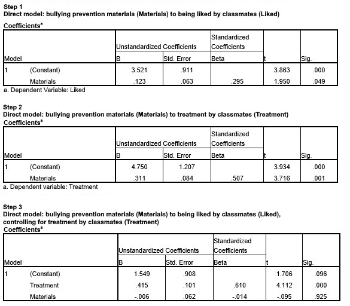

```{r, echo = FALSE, results = "hide"}
include_supplement("uu-Mediation-809-nl-tabel.jpg", recursive = TRUE)
```

Question
========
A sociometric study of friendship formation in elementary schools looks at how liked children are by their classmates (EARTH measured on a scale of 0-10). The researchers believe that the number of hours a student spends studying material aimed at bullying prevention (MATERIAL) helps for how students treat classmates (TREATMENT) and thus that treatment in turn has an effect on how liked the student is found by classmates (EARTH).

The following SPSS output gives the results for the different steps of an analysis of mediation (with $\alpha$ = .05).




Which statements are correct? I. In this study, MATERIAL is the variable with a mediating role. II. There is partial mediation.

Answerlist
----------
* I is correct. II is correct.
* I is correct. II is not correct.
* I is not correct. II is correct.
* I is not right. II is not right.


Solution
========

Meta-information
================
exname: uu-Mediation-809-en
extype: schoice
exsolution: 0001
exsection: Inferential Statistics/Regression/Multiple linear regression/Mediation
exextra[Type]: Interpretating output
exextra[Program]: SPSS
exextra[Language]: English
exextra[Level]: Statistical Literacy