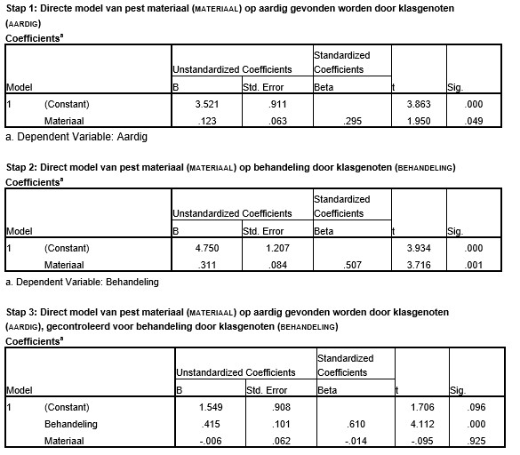

```{r, echo = FALSE, results = "hide"}
include_supplement("uu-Mediation-809-nl-tabel.jpg", recursive = TRUE)
```


Question
========
In een sociometrisch onderzoek naar vriendschapsvorming op basisscholen wordt gekeken naar hoe aardig kinderen worden gevonden door hun klasgenootjes (AARDIG gemeten op een schaal van 0-10). De onderzoekers denken dat het aantal uren dat een leerlingen besteedt aan het bestuderen van materiaal gericht op preventie van pesten (MATERIAAL) helpt voor hoe leerlingen klasgenoten behandelen (BEHANDELING) en daarmee heeft die behandeling op zijn beurt een effect op hoe aardig de leerling wordt gevonden door klasgenoten (AARDIG).

De volgende SPSS uitvoer geeft de resultaten voor de verschillende stappen  van een analyse van mediatie (met $\alpha$ = .05).




Welke uitspraken zijn juist?
I. In dit onderzoek is MATERIAAL de variabele met een mediërende rol.
II. Er is sprake van een partiële mediatie.

Answerlist
----------
* I is juist. II is juist.
* I is juist. II is niet juist.
* I is niet juist. II is juist.
* I is niet juist. II is niet juist.


Solution
========


Meta-information
================
exname: uu-Mediation-809-nl
extype: schoice
exsolution: 0001
exsection: Inferential Statistics/Regression/Multiple linear regression/Mediation
exextra[ID]: 5e64a
exextra[Type]: Interpretating output
exextra[Program]: SPSS
exextra[Language]: Dutch
exextra[Level]: Statistical Literacy