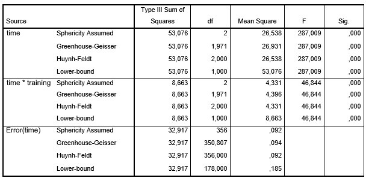

```{r, echo = FALSE, results = "hide"}
include_supplement("uu-Mixed-design-ANOVA-601-nl-tabel-1.jpg", recursive = TRUE)
```
```{r, echo = FALSE, results = "hide"}
include_supplement("uu-Mixed-design-ANOVA-601-nl-tabel-2.jpg", recursive = TRUE)
```
Question
========
The idea is that exam training not only increases the likelihood of passing a test, but also increases pleasure in methods and techniques of research. The SPSS output below shows the results of an experiment on the effect of exam training (TRAINING with 0 = no training, 1 = training) on a test for enjoyment of methods and techniques (PLEASURE with a rating of 1 to 10). This test was administered to the two groups three times (subject within factor TIME): (1) Before exam training; (2) Immediately after exam training; and (3) Six months after exam training. 





Rate the following three statements at $\alpha = .05$:

Statement I: PLEASURE averages differ significantly for the three measurement times.

Verdict II: The averages of the PLEZIER differ significantly for the two study groups.

Verdict III: The trends in the averages of PLEZIER differ between the two study groups.

Which statement or statements are correct?

 
Answerlist
----------
* Only statement I is correct.
* Only pronunciation I and pronunciation II are correct.
* Only pronunciation II and pronunciation III are correct.
* All statements are correct. 


Solution
========

Meta-information
================
exname: uu-Mixed-design-ANOVA-601-en
extype: schoice
exsolution: 0001
exsection: Inferential Statistics/Parametric Techniques/ANOVA/Mixed design ANOVA
exextra[ID]: dd32b
exextra[Type]: Interpretating output
exextra[Program]: SPSS
exextra[Language]: English
exextra[Level]: Statistical Literacy
