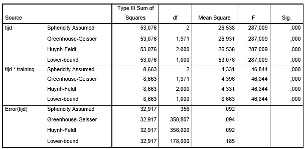
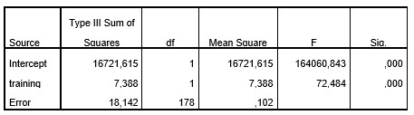

```{r, echo = FALSE, results = "hide"}
include_supplement("uu-Mixed-design-ANOVA-601-nl-tabel-1.jpg", recursive = TRUE)
```
```{r, echo = FALSE, results = "hide"}
include_supplement("uu-Mixed-design-ANOVA-601-nl-tabel-2.jpg", recursive = TRUE)
```
Question
========
Het idee is dat een tentamentraining niet alleen de kans van slagen op een toets vergroot, maar ook dat het plezier in methoden en technieken van onderzoek toeneemt. In de onderstaande SPSS uitvoer zie je de resultaten van een experiment naar het effect van tentamentraining (TRAINING met 0 = geen training, 1 = wel training) op een test voor plezier in methoden en technieken (PLEZIER  met een beoordeling van 1 tot en met  10). Deze test is bij de twee groepen drie keer afgenomen (subject binnenfactor TIJD): (1) Vóór de tentamentraining; (2) Direct ná de tentamentraining; en (3) Een half jaar na de tentamentraining. 






Beoordeel de onderstaande drie uitspraken bij $\alpha = .05$:

Uitspraak I: De gemiddelden van de PLEZIER verschillen significant voor de drie meetmomenten.

Uitspraak II: De gemiddelden van de PLEZIER verschillen significant voor de twee onderzoeksgroepen.

Uitspraak III: De ontwikkeling van de gemiddelden van PLEZIER verschilt tussen de twee onderzoeksgroepen.

Welke uitspraak is of welke uitspraken zijn correct?

 
Answerlist
----------
* Alleen uitspraak I is correct.
* Alleen uitspraak I en uitspraak II zijn correct.
* Alleen uitspraak II en uitspraak III zijn correct.
* Alle uitspraken zijn correct. 


Solution
========
  


Answerlist
----------


Meta-information
================
exname: uu-Mixed-design-ANOVA-601-nl.Rmd
extype: schoice
exsolution: 0001
exsection: Inferential Statistics/Parametric Techniques/ANOVA/Mixed design ANOVA
exextra[Type]: Interpretating output
exextra[Program]: SPSS
exextra[Language]: Dutch
exextra[Level]: Statistical Literacy
