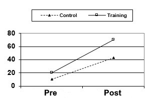

```{r, echo = FALSE, results = "hide"}
include_supplement("uu-Mixed-design-ANOVA-606-nl-tabel.jpg", recursive = TRUE)
```

Question
========
  
An educational researcher evaluates a new training method using a quasi-experimental design. She uses this method to teach gymnastics exercises in gym class. She uses two classes from the same school, with one class receiving the new teaching method (training group), and the other class receiving the old teaching method (control group). Both classes do not know that they are receiving different training. The result is measured by assessment by a trained gymnastics assessor of some standard exercises on each student. The group averages on pre-measurement and post-measurement looks as follows:



The researcher calculates the difference scores between pre-measurement and post-measurement for each person and they are statistically significantly different for the two groups. She concludes that the new teaching method is the cause of the higher results in the training group compared to the control group. 
Answerlist
----------
* This conclusion is correct.
* This conclusion cannot be drawn outright because the control class may have become discouraged.
* There may have been a greater regression effect in the training group than in the control group, making it difficult to make a statement about the new training method.
* All three options a, b, and c are incorrect.


Solution
========

Meta-information
================
exname: uu-Mixed-design-ANOVA-606-en
extype: schoice
exsolution: 0001
exsection: Inferential Statistics/Parametric Techniques/ANOVA/Mixed design ANOVA
exextra[Type]: Interpretating output
exextra[Language]: English
exextra[Level]: Statistical Literacy
